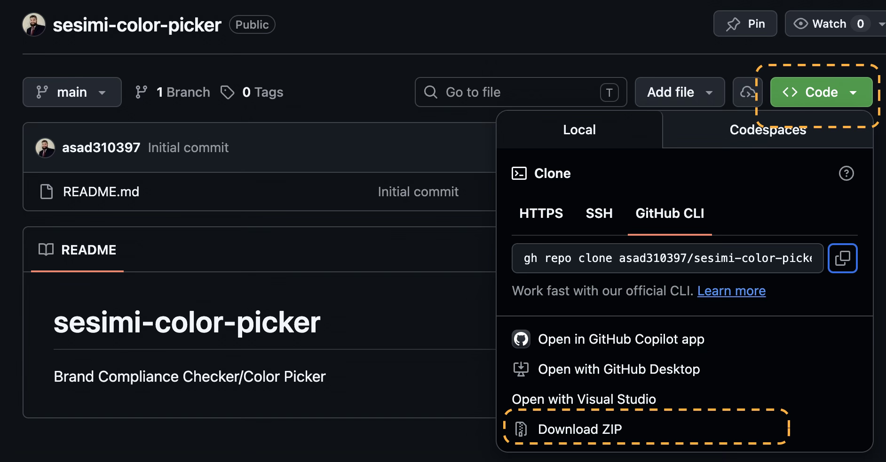
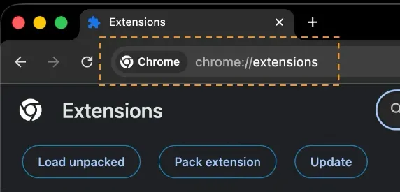
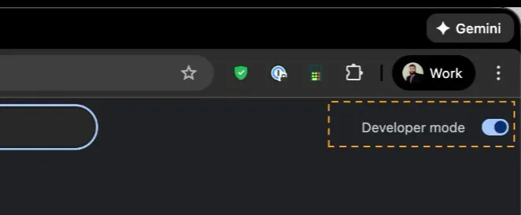
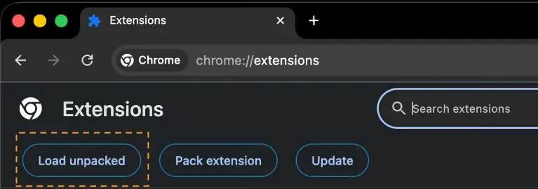
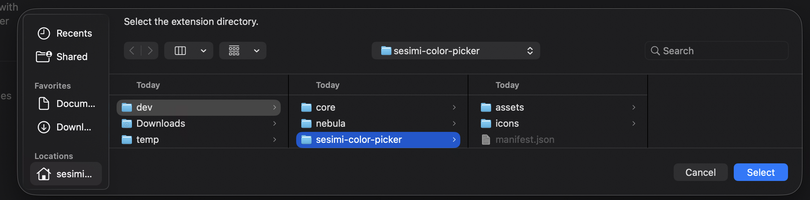

# sesimi-color-picker

Brand Compliance Checker/Color Picker

| Table of Contents                 |
| --------------------------------- |
| [How to set up](#how-to-set-up)   |
| [How to upgrade](#how-to-upgrade) |

# How to set up

Navigate to:

https://github.com/myadbox/sesimi-color-picker

Navigate to Code > Download ZIP:

Then open chrome

Type in: chrome://extensions

Then turn on developer mode:

Then click on Load unpacked:

Finally select the sesimi-color-picker and hit “Select” and you should have it loaded

# How to upgrade

Delete the sesimi-color-picker folder from where you saved it. Then repeat the set-up instructions again
